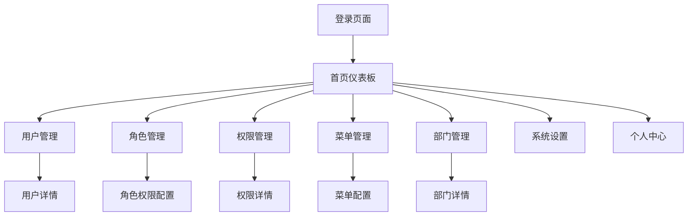

# 权限管理系统产品需求文档

## 1. Product Overview
权限管理系统是一个企业级的统一身份认证和权限控制平台，为组织提供用户、角色、权限的集中化管理。
系统支持多端访问（Web端、小程序端），实现细粒度的权限控制，帮助企业建立安全、高效的权限管理体系。
目标是为中大型企业提供标准化的权限管理解决方案，提升管理效率并确保数据安全。

## 2. Core Features

### 2.1 User Roles
| Role | Registration Method | Core Permissions |
|------|---------------------|------------------|
| 超级管理员 | 系统初始化创建 | 拥有系统所有权限，可管理所有用户和配置 |
| 系统管理员 | 超级管理员创建 | 可管理用户、角色、权限，但不能修改系统配置 |
| 部门管理员 | 系统管理员创建 | 可管理本部门用户和角色分配 |
| 普通用户 | 管理员创建或自助注册 | 根据分配的角色使用相应功能 |

### 2.2 Feature Module
我们的权限管理系统包含以下主要页面：
1. **登录页面**：用户认证、多种登录方式、验证码验证
2. **首页仪表板**：系统概览、数据统计、快捷操作入口
3. **用户管理页面**：用户列表、用户信息编辑、状态管理
4. **角色管理页面**：角色定义、权限分配、角色层级管理
5. **权限管理页面**：权限树结构、权限分组、权限配置
6. **菜单管理页面**：菜单结构配置、路由管理、图标设置
7. **部门管理页面**：组织架构管理、部门层级、人员分配
8. **系统设置页面**：系统参数配置、安全策略、日志管理
9. **个人中心页面**：个人信息修改、密码修改、操作记录

### 2.3 Page Details
| Page Name | Module Name | Feature description |
|-----------|-------------|---------------------|
| 登录页面 | 用户认证模块 | 支持用户名密码登录、手机号登录、扫码登录，包含验证码验证、记住登录状态、找回密码功能 |
| 首页仪表板 | 数据概览模块 | 显示用户总数、在线用户数、权限分配统计，提供快捷操作入口和系统公告展示 |
| 用户管理页面 | 用户CRUD模块 | 用户列表查询、新增用户、编辑用户信息、删除用户、批量操作、用户状态启用禁用 |
| 用户管理页面 | 角色分配模块 | 为用户分配角色、查看用户权限、角色变更记录 |
| 角色管理页面 | 角色CRUD模块 | 角色列表管理、新增角色、编辑角色信息、删除角色、角色复制功能 |
| 角色管理页面 | 权限配置模块 | 为角色分配权限、权限树选择、权限继承关系配置 |
| 权限管理页面 | 权限树管理 | 权限树结构展示、权限节点增删改、权限分组管理、权限代码配置 |
| 菜单管理页面 | 菜单配置模块 | 菜单树结构管理、菜单路由配置、图标选择、菜单排序、显示隐藏控制 |
| 部门管理页面 | 组织架构模块 | 部门树结构管理、部门信息维护、部门人员管理、部门权限继承 |
| 系统设置页面 | 系统配置模块 | 系统参数设置、密码策略配置、登录安全策略、系统日志查看 |
| 个人中心页面 | 个人信息模块 | 个人资料修改、头像上传、密码修改、登录记录查看 |

## 3. Core Process

**超级管理员流程：**
系统初始化 → 创建系统管理员 → 配置基础权限和菜单 → 创建部门结构 → 监控系统运行

**系统管理员流程：**
登录系统 → 创建部门和角色 → 配置权限分配 → 创建用户账号 → 分配用户角色 → 监控用户活动

**部门管理员流程：**
登录系统 → 管理本部门用户 → 调整用户角色 → 查看部门权限使用情况

**普通用户流程：**
登录系统 → 使用被授权的功能模块 → 修改个人信息 → 查看操作记录

## 4. User Interface Design
### 4.1 Design Style
- **主色调**：#409EFF（蓝色）作为主色，#67C23A（绿色）作为成功色，#F56C6C（红色）作为警告色
- **辅助色**：#909399（灰色）用于次要文本，#DCDFE6（浅灰）用于边框
- **按钮样式**：圆角按钮设计，主要按钮采用实心样式，次要按钮采用边框样式
- **字体**：主要使用14px字号，标题使用16px-20px，小字使用12px
- **布局风格**：左侧导航+顶部面包屑的经典后台布局，卡片式内容展示
- **图标风格**：使用Element Plus图标库，简洁线性图标风格

### 4.2 Page Design Overview
| Page Name | Module Name | UI Elements |
|-----------|-------------|-------------|
| 登录页面 | 登录表单 | 居中卡片布局，渐变背景，表单验证提示，登录方式切换标签 |
| 首页仪表板 | 统计卡片 | 4列统计卡片布局，图表展示，快捷操作按钮网格，公告滚动展示 |
| 用户管理页面 | 用户列表 | 搜索筛选栏，表格展示，分页组件，操作按钮组，状态标签显示 |
| 角色管理页面 | 角色配置 | 左右分栏布局，左侧角色列表，右侧权限树选择器，拖拽排序 |
| 权限管理页面 | 权限树 | 树形结构展示，节点图标，展开折叠动画，右键菜单操作 |
| 菜单管理页面 | 菜单配置 | 树形表格，拖拽排序，图标选择器，路由配置表单 |
| 部门管理页面 | 组织架构 | 树形结构，部门卡片展示，人员头像列表，层级缩进显示 |
| 系统设置页面 | 配置表单 | 标签页分组，表单验证，开关组件，数值输入器 |
| 个人中心页面 | 个人信息 | 头像上传组件，表单布局，密码强度指示器，操作记录时间轴 |

### 4.3 Responsiveness
系统采用桌面优先设计，支持平板和手机端自适应。小程序端采用专门的移动端UI设计，优化触摸交互体验，支持手势操作和移动端特有的交互模式。