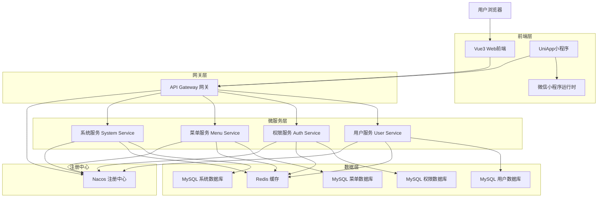
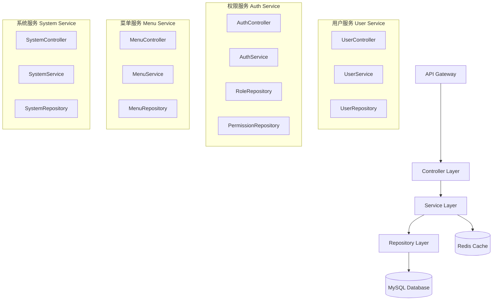
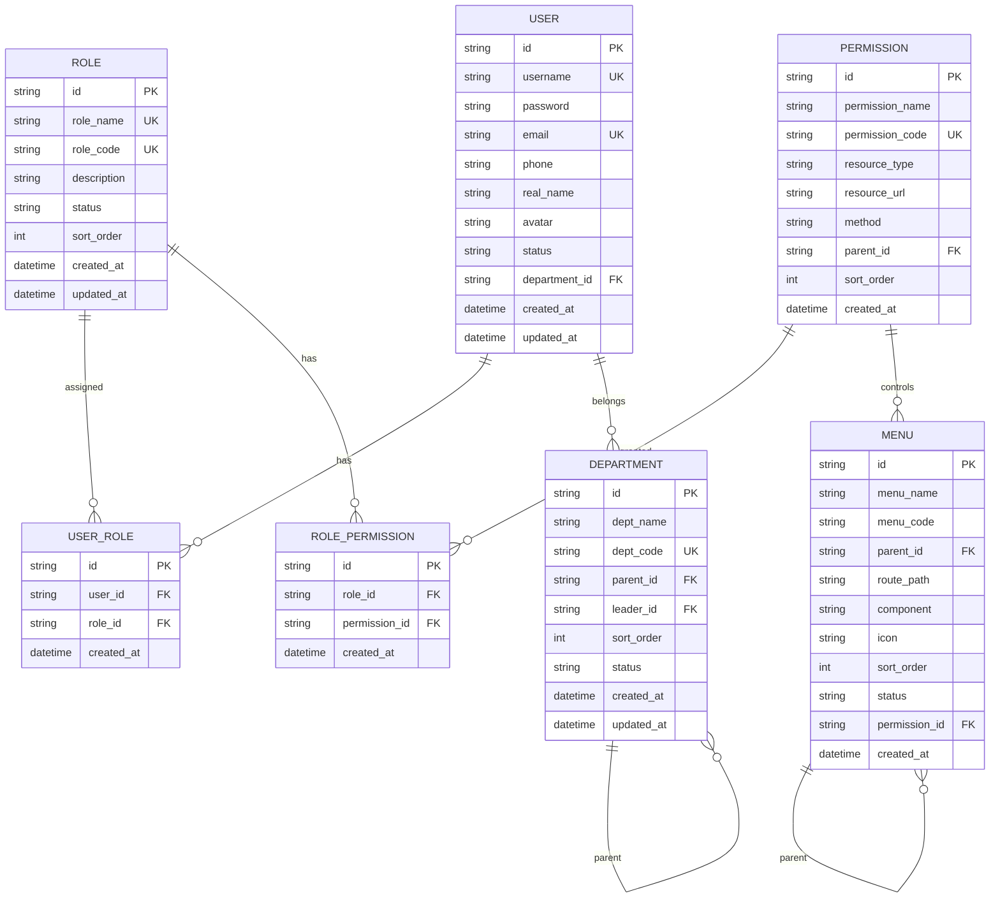

# 权限管理系统技术架构文档

## 1. Architecture design



## 2. Technology Description

* **Web前端**: Vue3\@3.3 + TypeScript\@5.0 + Vite\@4.4 + Element Plus\@2.3 + Vue Router\@4.2 + Pinia\@2.1

* **小程序前端**: UniApp + Vue3 + TypeScript + uView UI\@2.0

* **API网关**: Spring Cloud Gateway\@3.1

* **微服务框架**: Spring Boot\@2.7 + Spring Cloud\@2021.0.8

* **服务注册发现**: Nacos\@2.2

* **数据库**: MySQL\@8.0

* **缓存**: Redis\@7.0

* **认证授权**: Spring Security + JWT

* **API文档**: Swagger\@3.0

## 3. Route definitions

### 3.1 Web前端路由

| Route            | Purpose         |
| ---------------- | --------------- |
| /login           | 登录页面，用户身份认证     |
| /dashboard       | 首页仪表板，系统概览和快捷操作 |
| /user/list       | 用户管理列表页面        |
| /user/detail/:id | 用户详情页面          |
| /role/list       | 角色管理列表页面        |
| /role/detail/:id | 角色详情和权限配置页面     |
| /permission/list | 权限管理页面，权限树结构展示  |
| /menu/list       | 菜单管理页面，菜单配置     |
| /department/list | 部门管理页面，组织架构管理   |
| /system/settings | 系统设置页面          |
| /profile         | 个人中心页面          |

### 3.2 小程序路由

| Route                   | Purpose     |
| ----------------------- | ----------- |
| /pages/login/index      | 小程序登录页面     |
| /pages/index/index      | 小程序首页       |
| /pages/user/list        | 用户列表页面（简化版） |
| /pages/profile/index    | 个人中心页面      |
| /pages/department/index | 部门信息查看页面    |

## 4. API definitions

### 4.1 Core API

#### 用户认证相关

```
POST /api/auth/login
```

Request:

| Param Name | Param Type | isRequired | Description         |
| ---------- | ---------- | ---------- | ------------------- |
| username   | string     | true       | 用户名或手机号             |
| password   | string     | true       | 密码                  |
| captcha    | string     | true       | 验证码                 |
| loginType  | string     | true       | 登录类型：username/phone |

Response:

| Param Name        | Param Type | Description |
| ----------------- | ---------- | ----------- |
| code              | number     | 响应状态码       |
| message           | string     | 响应消息        |
| data              | object     | 用户信息和token  |
| data.token        | string     | JWT访问令牌     |
| data.refreshToken | string     | 刷新令牌        |
| data.userInfo     | object     | 用户基本信息      |

#### 用户管理相关

```
GET /api/user/list
```

Request:

| Param Name   | Param Type | isRequired | Description          |
| ------------ | ---------- | ---------- | -------------------- |
| page         | number     | false      | 页码，默认1               |
| size         | number     | false      | 每页大小，默认10            |
| keyword      | string     | false      | 搜索关键词                |
| status       | string     | false      | 用户状态：active/inactive |
| departmentId | string     | false      | 部门ID                 |

Response:

| Param Name   | Param Type | Description |
| ------------ | ---------- | ----------- |
| code         | number     | 响应状态码       |
| data         | object     | 分页数据        |
| data.records | array      | 用户列表        |
| data.total   | number     | 总记录数        |
| data.pages   | number     | 总页数         |

```
POST /api/user/create
```

Request:

| Param Name   | Param Type | isRequired | Description |
| ------------ | ---------- | ---------- | ----------- |
| username     | string     | true       | 用户名         |
| password     | string     | true       | 密码          |
| email        | string     | true       | 邮箱          |
| phone        | string     | false      | 手机号         |
| realName     | string     | true       | 真实姓名        |
| departmentId | string     | true       | 部门ID        |
| roleIds      | array      | true       | 角色ID数组      |

#### 角色权限相关

```
GET /api/role/list
```

```
POST /api/role/create
```

```
PUT /api/role/permissions/:roleId
```

#### 权限管理相关

```
GET /api/permission/tree
```

```
POST /api/permission/create
```

#### 菜单管理相关

```
GET /api/menu/tree
```

```
POST /api/menu/create
```

## 5. Server architecture diagram



## 6. Data model

### 6.1 Data model definition



### 6.2 Data Definition Language

#### 用户表 (sys\_user)

```sql
-- 创建用户表
CREATE TABLE sys_user (
    id VARCHAR(32) PRIMARY KEY DEFAULT (REPLACE(UUID(), '-', '')),
    username VARCHAR(50) UNIQUE NOT NULL COMMENT '用户名',
    password VARCHAR(100) NOT NULL COMMENT '密码',
    email VARCHAR(100) UNIQUE NOT NULL COMMENT '邮箱',
    phone VARCHAR(20) COMMENT '手机号',
    real_name VARCHAR(50) NOT NULL COMMENT '真实姓名',
    avatar VARCHAR(200) COMMENT '头像URL',
    status ENUM('active', 'inactive', 'locked') DEFAULT 'active' COMMENT '状态',
    department_id VARCHAR(32) COMMENT '部门ID',
    created_at TIMESTAMP DEFAULT CURRENT_TIMESTAMP,
    updated_at TIMESTAMP DEFAULT CURRENT_TIMESTAMP ON UPDATE CURRENT_TIMESTAMP,
    INDEX idx_username (username),
    INDEX idx_email (email),
    INDEX idx_department (department_id),
    INDEX idx_status (status)
) ENGINE=InnoDB DEFAULT CHARSET=utf8mb4 COMMENT='用户表';

-- 创建角色表
CREATE TABLE sys_role (
    id VARCHAR(32) PRIMARY KEY DEFAULT (REPLACE(UUID(), '-', '')),
    role_name VARCHAR(50) UNIQUE NOT NULL COMMENT '角色名称',
    role_code VARCHAR(50) UNIQUE NOT NULL COMMENT '角色编码',
    description VARCHAR(200) COMMENT '角色描述',
    status ENUM('active', 'inactive') DEFAULT 'active' COMMENT '状态',
    sort_order INT DEFAULT 0 COMMENT '排序',
    created_at TIMESTAMP DEFAULT CURRENT_TIMESTAMP,
    updated_at TIMESTAMP DEFAULT CURRENT_TIMESTAMP ON UPDATE CURRENT_TIMESTAMP,
    INDEX idx_role_code (role_code),
    INDEX idx_status (status)
) ENGINE=InnoDB DEFAULT CHARSET=utf8mb4 COMMENT='角色表';

-- 创建权限表
CREATE TABLE sys_permission (
    id VARCHAR(32) PRIMARY KEY DEFAULT (REPLACE(UUID(), '-', '')),
    permission_name VARCHAR(100) NOT NULL COMMENT '权限名称',
    permission_code VARCHAR(100) UNIQUE NOT NULL COMMENT '权限编码',
    resource_type ENUM('menu', 'button', 'api') NOT NULL COMMENT '资源类型',
    resource_url VARCHAR(200) COMMENT '资源URL',
    method VARCHAR(10) COMMENT 'HTTP方法',
    parent_id VARCHAR(32) COMMENT '父权限ID',
    sort_order INT DEFAULT 0 COMMENT '排序',
    created_at TIMESTAMP DEFAULT CURRENT_TIMESTAMP,
    INDEX idx_permission_code (permission_code),
    INDEX idx_parent_id (parent_id),
    INDEX idx_resource_type (resource_type)
) ENGINE=InnoDB DEFAULT CHARSET=utf8mb4 COMMENT='权限表';

-- 创建用户角色关联表
CREATE TABLE sys_user_role (
    id VARCHAR(32) PRIMARY KEY DEFAULT (REPLACE(UUID(), '-', '')),
    user_id VARCHAR(32) NOT NULL COMMENT '用户ID',
    role_id VARCHAR(32) NOT NULL COMMENT '角色ID',
    created_at TIMESTAMP DEFAULT CURRENT_TIMESTAMP,
    UNIQUE KEY uk_user_role (user_id, role_id),
    INDEX idx_user_id (user_id),
    INDEX idx_role_id (role_id)
) ENGINE=InnoDB DEFAULT CHARSET=utf8mb4 COMMENT='用户角色关联表';

-- 创建角色权限关联表
CREATE TABLE sys_role_permission (
    id VARCHAR(32) PRIMARY KEY DEFAULT (REPLACE(UUID(), '-', '')),
    role_id VARCHAR(32) NOT NULL COMMENT '角色ID',
    permission_id VARCHAR(32) NOT NULL COMMENT '权限ID',
    created_at TIMESTAMP DEFAULT CURRENT_TIMESTAMP,
    UNIQUE KEY uk_role_permission (role_id, permission_id),
    INDEX idx_role_id (role_id),
    INDEX idx_permission_id (permission_id)
) ENGINE=InnoDB DEFAULT CHARSET=utf8mb4 COMMENT='角色权限关联表';

-- 创建部门表
CREATE TABLE sys_department (
    id VARCHAR(32) PRIMARY KEY DEFAULT (REPLACE(UUID(), '-', '')),
    dept_name VARCHAR(50) NOT NULL COMMENT '部门名称',
    dept_code VARCHAR(50) UNIQUE NOT NULL COMMENT '部门编码',
    parent_id VARCHAR(32) COMMENT '父部门ID',
    leader_id VARCHAR(32) COMMENT '部门负责人ID',
    sort_order INT DEFAULT 0 COMMENT '排序',
    status ENUM('active', 'inactive') DEFAULT 'active' COMMENT '状态',
    created_at TIMESTAMP DEFAULT CURRENT_TIMESTAMP,
    updated_at TIMESTAMP DEFAULT CURRENT_TIMESTAMP ON UPDATE CURRENT_TIMESTAMP,
    INDEX idx_dept_code (dept_code),
    INDEX idx_parent_id (parent_id),
    INDEX idx_status (status)
) ENGINE=InnoDB DEFAULT CHARSET=utf8mb4 COMMENT='部门表';

-- 创建菜单表
CREATE TABLE sys_menu (
    id VARCHAR(32) PRIMARY KEY DEFAULT (REPLACE(UUID(), '-', '')),
    menu_name VARCHAR(50) NOT NULL COMMENT '菜单名称',
    menu_code VARCHAR(50) COMMENT '菜单编码',
    parent_id VARCHAR(32) COMMENT '父菜单ID',
    route_path VARCHAR(200) COMMENT '路由路径',
    component VARCHAR(200) COMMENT '组件路径',
    icon VARCHAR(50) COMMENT '图标',
    sort_order INT DEFAULT 0 COMMENT '排序',
    status ENUM('show', 'hide') DEFAULT 'show' COMMENT '显示状态',
    permission_id VARCHAR(32) COMMENT '关联权限ID',
    created_at TIMESTAMP DEFAULT CURRENT_TIMESTAMP,
    INDEX idx_parent_id (parent_id),
    INDEX idx_permission_id (permission_id),
    INDEX idx_status (status)
) ENGINE=InnoDB DEFAULT CHARSET=utf8mb4 COMMENT='菜单表';

-- 初始化数据
-- 插入超级管理员用户
INSERT INTO sys_user (id, username, password, email, real_name, status) 
VALUES ('admin001', 'admin', '$2a$10$7JB720yubVSOfvVWbGReyO.ZhMh6vcflhdR9HFqL8paWHS.Uy9F8.', 'admin@example.com', '超级管理员', 'active');

-- 插入基础角色
INSERT INTO sys_role (id, role_name, role_code, description) VALUES 
('role001', '超级管理员', 'SUPER_ADMIN', '拥有系统所有权限'),
('role002', '系统管理员', 'SYSTEM_ADMIN', '系统管理权限'),
('role003', '部门管理员', 'DEPT_ADMIN', '部门管理权限'),
('role004', '普通用户', 'USER', '基础用户权限');

-- 插入基础权限
INSERT INTO sys_permission (id, permission_name, permission_code, resource_type) VALUES 
('perm001', '用户管理', 'user:manage', 'menu'),
('perm002', '角色管理', 'role:manage', 'menu'),
('perm003', '权限管理', 'permission:manage', 'menu'),
('perm004', '菜单管理', 'menu:manage', 'menu'),
('perm005', '部门管理', 'dept:manage', 'menu');

-- 分配超级管理员角色
INSERT INTO sys_user_role (user_id, role_id) VALUES ('admin001', 'role001');
```

